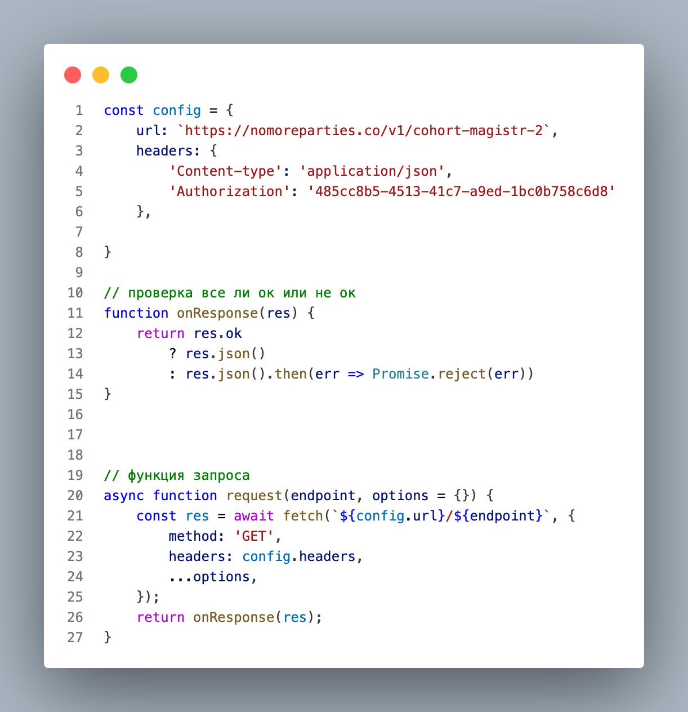

# Проектная работа Mesto
 https://mirodeiss.github.io/mesto-ff
 ## "Место"— веб-сервис (аналог unsplash и pinterest) для обмена фотографиями между пользователями в различных местах нашей планеты. 
 
 
 ### Цель в создании удобного сервиса, а также в совершенствовании навыков разработки. 
 ### Фокус проекта на использовании языка JavaScript, работе с массивами, функциями, объектами и другими конструкциями языка. 
 ### Взаимодействие с сервером—работа с (api , Http протоколом) get, post, patch, delete запросы. 
 
 ### Получение данных и информации о пользователе.
 ### Работа с формами, валидация форм и попапов.
 
 
 ###  Cборка проекта с использованием Webpack.
 ### Верстка HTML, CSS с файловой структурой по БЭМ. Управление версиями проекта Git.
